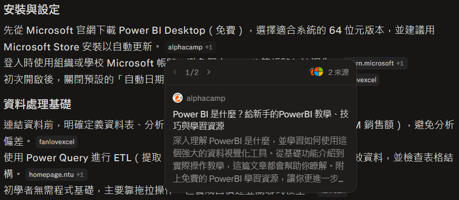
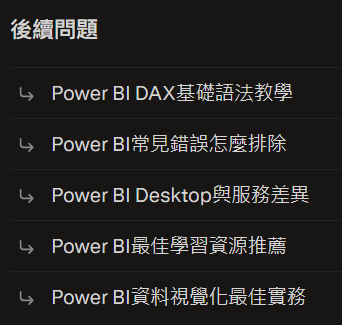
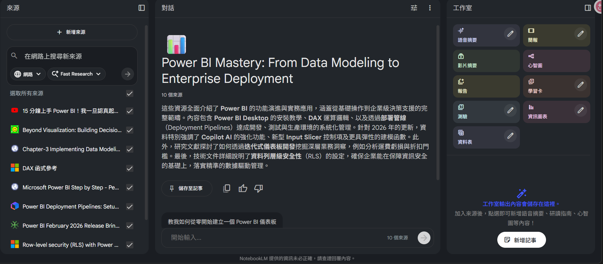

## 自我介紹:
老師你好，我是一名亞東科技大學的學生，平常喜歡睡覺耍廢，偶爾會在github上面找一些有趣的程式專案來玩以下提供一些有趣的專案 
[城市地圖生成](https://github.com/originalankur/maptoposter)

他可以生成很多樣式的風格，礙於時間有限我沒有辦法在課堂中生成漂亮的地圖，我之前有生成出像是知名遊戲Grand Theft Auto V的地圖真的非常地好玩。 
另一個專案就是    
[台灣交通系統](https://mini-taiwan-learning-project.zeabur.app/)

[台灣交通系統開源檔案](https://github.com/ianlkl11234s/mini-taiwan-pulse)

這是我平常滑手機看的到，因為這是台灣的所以更加有感覺，他有一個最主要能夠讓我有學習動機的原因是他使用Claude Code 協作完成，我可以說現在這個時代如果要學生能夠從無到有的完成寫程式這個動作是不太可能的，但是如果AI能夠完成主程式邏輯讓學生慢慢地學習是有辦法的，這些專案做出來的功能或許沒有用處就是炫泡但是對於我們這些懼怕程式的卻非常有用。

# 學期預習與複習計畫(成績 60分以上):
## 預習
我個人的學習方式比較特別，不太習慣舉手發問，喜愛自行鑽研當找到答案會非常有成就感。 
有鑑於老師您都把教學紀錄放在discord、github因此我可以從歷屆學習資料去撈資料，找到的資料彙整後請perplexity整理，這裡我使用的是Comet瀏覽器因此使用起來更加方便，由於他的設計與其他AI不太相同，除了擁有像其他AI會告訴答案外還會提供資料來源(大都AI都需提示提告知，且資料不一定正確)有點像是Google搜尋功能，更重要的是會列出後續我們可能會有的疑惑

## 複習
既然前面有了基礎那我們就可以換一個工具Notebooklm，除了上課資料外還可以用他內部整合的Gemini去找更多資源

左邊可以上傳霍線上找資料，中間用來問問題，同樣也會有建議問題，這裡比較特別的是右邊，我特別常用心智圖、學習卡、測驗，如果心情差的時候可以改用語音摘要就像在聽Podcast，我覺得Google的聲音是調的不錯不會有很大的AI感