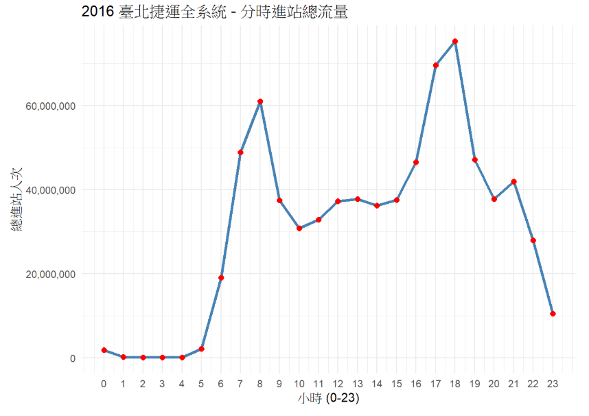

自我介紹:
老師你好，我是一名亞東科技大學的學生，平常喜歡睡覺耍廢，偶爾會在github上面找一些有趣的程式專案來玩以下提供一些有趣的專案 
[城市地圖生成](https://github.com/originalankur/maptoposter)

他可以生成很多樣式的風格，礙於時間有限我沒有辦法在課堂中生成漂亮的地圖，我之前有生成出像是知名遊戲Grand Theft Auto V的地圖真的非常地好玩。 
另一個專案就是    
[台灣交通系統](https://mini-taiwan-learning-project.zeabur.app/)

[台灣交通系統開源檔案](https://github.com/ianlkl11234s/mini-taiwan-pulse)

這是我平常滑手機看的到，因為這是台灣的所以更加有感覺，他有一個最主要能夠讓我有學習動機的原因是他使用Claude Code 協作完成，我可以說現在這個時代如果要學生能夠從無到有的完成寫程式這個動作是不太可能的，但是如果AI能夠完成主程式邏輯讓學生慢慢地學習是有辦法的，這些專案做出來的功能或許沒有用處就是炫泡但是對於我們這些懼怕程式的卻非常有用。

# 目前可分析的資料、位置與說明
我用我之前「巨量分析課程」的期末報告來舉例，我在[「臺北市資料大平臺」](https://data.taipei/dataset/detail?id=1d71c478-205f-42c5-8386-35f86d74fdd1)

下載進出站資料，利用R語言分析，分析結果可以分為以下三項:

一、車站功能:我們可以透過各時段進出站人數分析該車站為(住宅、 辦公、觀光)等功能。

二、城市人流軌跡:如早晨會湧入臺北市中心。

三、特殊事件:如跨年活動(象山、臺北101)、國際比賽(國父紀念館站(臺北大巨蛋))

分析這些能到來的功能

一、調整班距:尖峰時刻迅速紓解人潮，離峰時刻拉長班距達到永續目標SDGs 13 減碳

二、政府都市更新計劃:TOD（大眾運輸導向型發展）政策，如:士林站臺北流行音樂中心，未來劍潭站、劍南路站耶將會有

公車班距的銜接，民眾一下捷運即可搭上公車

以下是部分分析結果:

